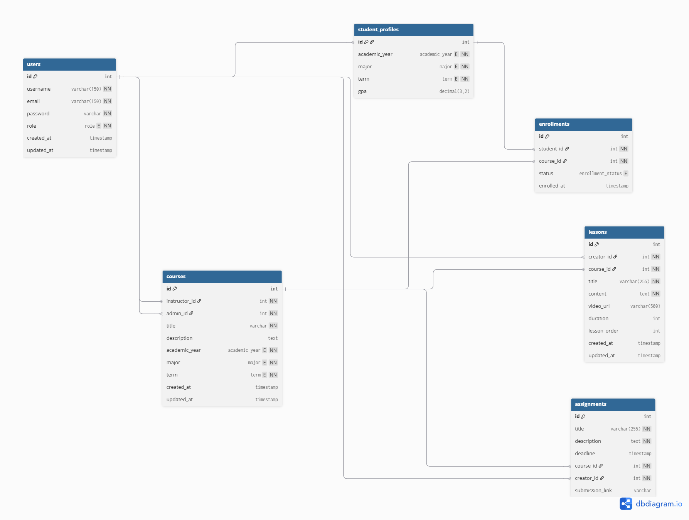

# E-Learning System 🎓

A scalable **E-Learning Backend System** built using **NestJS**, **TypeORM**, and **PostgreSQL**, following clean architecture principles and real-world backend best practices.

This project is designed to manage users, courses, enrollments, and student profiles with proper role-based access control and a clean relational database structure.

---

## Overview

The E-Learning System provides a robust backend foundation for an online learning platform where:

- **Instructors** can create and manage courses and lessons.
- **Students** can enroll in courses and manage their profiles.
- **Admins** have full control over the system.
- Data integrity is preserved using proper relations and cascade rules.

The project focuses on **backend correctness, scalability, and clean code**.

---

## Features

### Authentication & Authorization

- **JWT-based authentication** for secure access.
- **Role-Based Access Control (RBAC)** ensuring users only access what they are permitted to.
- Guards for protecting sensitive endpoints.

### User Management

- distinct roles: **Admin**, **Instructor**, **Student**.
- Secure password hashing (typically using bcrypt).

### Course Management

- **Courses**: Create, update, delete, and view courses.
- **Lessons**: structured content within courses.
- **Dynamic Ordering**: Lessons can be ordered and reordered within a course.
- **Assignments**: Create and manage course assignments with deadlines and submission links.

### Enrollments

- Students can enroll in available courses.
- Tracking of enrollment status.

### Student Profiles

- Dedicated profiles for students to manage their personal information and progress.

### Architecture

- **Modular NestJS structure**: Separation of concerns into specific modules.
- **DTOs**: Data Transfer Objects for robust request validation.
- **TypeORM**: specific entities and relationships (One-to-Many, Many-to-One).

---

## Tech Stack

- **Runtime**: Node.js
- **Framework**: NestJS
- **Language**: TypeScript
- **Database**: PostgreSQL
- **ORM**: TypeORM
- **Authentication**: JWT (JSON Web Tokens)
- **Validation**: class-validator, class-transformer

---

## Environment Setup

Create a `.env` file in the root directory with the following variables:

```env
# Database Configuration
DB_HOST=localhost
DB_PORT=5432
DB_USERNAME=your_username
DB_PASSWORD=your_password
DB_NAME=your_database_name

# Authentication
JWT_SECRET=your_super_secret_key
# Optional: JWT_EXPIRATION=3600s
```

---

## Installation

1. **Clone the repository**

   ```bash
   git clone <repository-url>
   cd e-learning-system
   ```

2. **Install dependencies**
   ```bash
   npm install
   ```

---

## Running the Application

1. **Development Mode**

   ```bash
   npm run start:dev
   ```

2. **Production Mode**
   ```bash
   npm run build
   npm run start:prod
   ```

---

## Project Structure

```bash
src/
├── config/             # Database and global configuration
├── modules/            # Feature modules
│   ├── users/          # User management & Auth
│   ├── mail/           # Mail service
│   ├── courses/        # Courses & Lessons management
│   ├── enrollments/    # Course enrollment handling
│   └── profiles/       # Student profiles
├── app.module.ts       # Main application module
└── main.ts             # Application entry point
```

Each module typically contains:

- `*.controller.ts`: Handles incoming requests.
- `*.service.ts`: Contains business logic.
- `*.entity.ts`: Database models.
- `dto/`: Data Transfer Objects for validation.

---

## Database Design & Relationships

### Relationships

- **Users**
  - Can have one **Student Profile** (if role = `STUDENT`).
  - Can create multiple **Courses** (as `INSTRUCTOR`).
  - Can manage multiple **Courses** (as `ADMIN`).
  - Can create multiple **Lessons** and **Assignments**.

- **Student Profiles**
  - Belong to exactly one **User** (One-to-One relationship).
  - Can enroll in multiple **Courses** through **Enrollments**.

- **Courses**
  - Belong to one **Instructor** (`User`).
  - Belong to one **Admin** (`User`).
  - Can contain multiple **Lessons** (One-to-Many).
  - Can contain multiple **Assignments** (One-to-Many).
  - Can have multiple enrolled **Students** via **Enrollments**.

- **Enrollments**
  - Belong to one **Student Profile** (Many-to-One).
  - Belong to one **Course** (Many-to-One).
  - Track enrollment `status` and `enrolled_at` timestamp.
  - Prevent duplicate enrollments using a composite unique constraint (`student_id`, `course_id`).

- **Lessons**
  - Belong to one **Course** (Many-to-One).
  - Created by one **User**.

- **Assignments**
  - Belong to one **Course** (Many-to-One).
  - Created by one **User**.

---

### Entity Relationship Diagram (ERD)

The following diagram represents the relational database structure of the system:



---

## Module Relations

The system is built around interconnected modules that define the platform's core functionality:

### 1. User & Profile Relation

- Each **User** (specifically with the `STUDENT` role) is linked to a **Student Profile** via a **One-to-One** relationship.
- The **User** entity handles authentication and basic credentials, while the **Student Profile** stores academic data (Major, Term, GPA, etc.).

### 2. Course Hierarchy

- **Courses** are the central entity.
- A **Course** can have multiple **Lessons** (content) and **Assignments** (tasks) via **One-to-Many** relationships.
- **Assignments** are directly linked to a course, allowing instructors to create coursework with deadlines and submission links.

### 3. Enrollment Flow

- The **Enrollment** module acts as a bridge between **Student Profiles** and **Courses**.
- It uses a **Many-to-One** relationship with both `StudentProfile` and `Course`.
- This allows tracking the status of a student's participation in a course (e.g., `ACTIVE`, `COMPLETED`, `DROPPED`).

---

## Roles

The system is designed with specific permissions for:

- **ADMIN**: Full system access.
- **INSTRUCTOR**: Can manage their own courses and lessons.
- **STUDENT**: Can view courses, enroll, and manage their profile.
